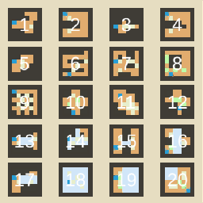
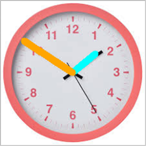

Hi, I'm Kai Jie, a 21 year-old university student from Singapore.

In my free time, sometimes I program useless things.

Here are some of my personal projects! [Github](https://github.com/wongkj12)

---

## TFT Rolling Odds Calculator
A calculator that provides the odds of hitting your units in TFT, made with very simple HTML and Chart.js.

Visit [here](https://wongkj12.github.io/TFT-Rolling-Odds-Calculator/).

## NUMBLOK 

A simple (but hopefully challenging) puzzle game made in Unity using C#. 

Visit [here](https://jkgnow.itch.io/numblok?secret=Y3TIcmz8VZtkA4AsdYdnAgCpgE).

      
## drawSR

An implementation of pix2pix on the browser with Tensorflow.js. Transform MS Paint drawings into the style of Summoner's Rift!  

[Link to interactive demo](https://wongkj12.github.io/drawSR/)

[Github page](https://github.com/wongkj12/drawSR)

    
## Clock Reader

An OpenCV project implemented in Android Studio so we never have to waste our time reading analogue clocks again.

Visit [here](https://wongkj12.github.io/clock-reader/).

[Github page](https://github.com/wongkj12/clock-reader)
